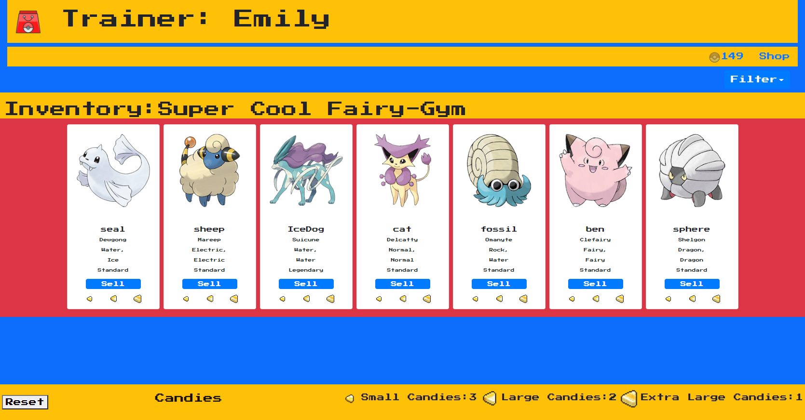
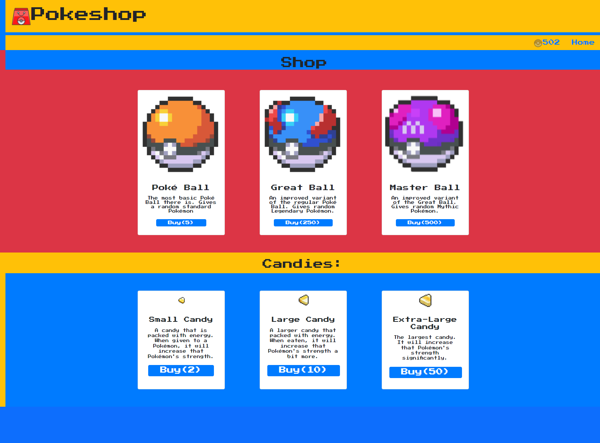

## Pokeshop 

A game in  which the user can buy, sell, and name pokemon
Trainers can name their own Pokemon Gym!g

## Screenshots

## Features

- Can type in name and gym name
- Sell and Buy Pokemon
- Naming Pokemon
- Buy Candies from shop
- Feed your Pokemon
- Filter your Pokemon by name, rarity or type
- Increase your money by clicking the button
- Reset Profile button

## Link

[Link to finshed webpage](https://vidalatan.github.io/poke-shop/index.html)

## Acknowledgements

 - [Very cool javascript animation library](https://animejs.com/)
 - [Pokemon API](https://rapidapi.com/chewett/api/pokemon-go1)
 - [Bootstrap](https://getbootstrap.com/docs/5.0/getting-started/introduction/)

## Authors

- [@Vidalatan](https://github.com/Vidalatan)
- [@alexwsalazar](https://github.com/alexwsalazar)
- [@Ja1993en](https://github.com/Ja1993en)
- [@Emily-MVaz](https://github.com/Emily-MVaz)

